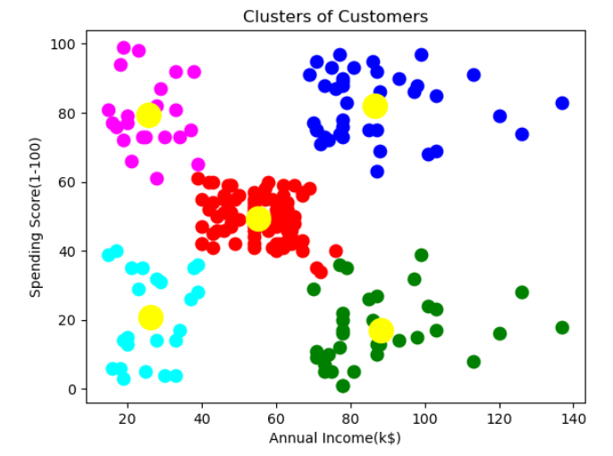

# Customer Segmentation using K-Means Clustering

This project demonstrates customer segmentation using the K-Means clustering algorithm. The dataset used is `input/Mall_Customers.csv`, which contains information about customers' annual income and spending scores.

## Table of Contents

- [Usage](#usage)
- [Project Structure](#project-structure)
- [Results](#results)

## Usage

1. Open the Jupyter Notebook:

   ```sh
   jupyter notebook model.ipynb
   ```

2. Run the cells in the notebook to perform the following steps:
   - Import necessary libraries
   - Load and explore the dataset
   - Visualize the data
   - Apply K-Means clustering
   - Visualize the clusters

## Project Structure

- `model.ipynb`: Jupyter Notebook containing the code for data loading, exploration, visualization, and clustering.
- `input/Mall_Customers.csv`: Dataset used for clustering.
- `README.md`: Project documentation.

## Results

The K-Means clustering algorithm segments the customers into 5 clusters based on their annual income and spending scores. The clusters are visualized using scatter plots.

### Example Visualization


